 
 
<h1 align="center">POETIZE-NEXT-WEB</h1>
<h2 align="center">📜诗与远方，博采方长🛤️</h2>
<h4 align="center">👩‍👩‍👧‍👦人 人 都 在 用 的 最 美 博 客📚</h4>
<h3 align="center">🌻请带上曾经的热情出发！🌞</h3>
<h3 align="center">✨遇见最美博客，下一站，出发！！🖌</h3>
<h3 align="center">️长江后浪推前浪，感谢每一位热爱分享的博主！</h3>
<h3 align="center">️点赞！⭐收藏！💬评论！🌟给个小星星！</h3>
<h3 align="center">☕请喝咖啡~</h3>

[预 览](https://blog.siaor.com) |
[官 网](http://www.siaor.com) |
[Q Q](https://qm.qq.com/cgi-bin/qm/qr?k=FE1-Pxzl-Ajo06_1asI4sE03C9YcUy20) |
[微 信](https://siaor.com/system/res/logo/wechat.jpg)

blog博客文章、相册、工具、友链、聊天室 IM

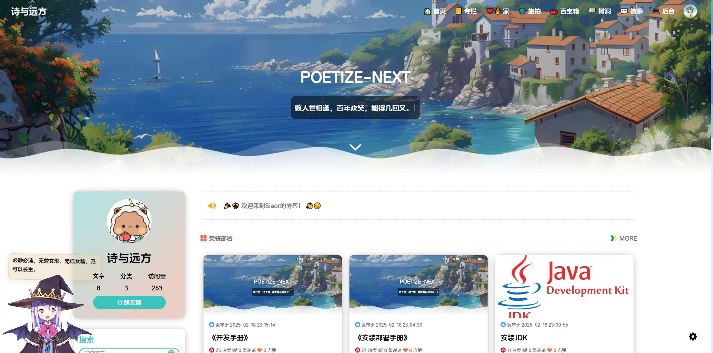

 

# 介绍
【POETIZE-NEXT】是基于[【LittleDonkey/POETIZE - 最美博客】](https://gitee.com/littledokey/poetize) 的后续改造项目，因为原项目不再维护，实属可惜。

于是，作为POETIZE的延续，**POETIZE-NEXT** 它来啦！下一站，让我们再次出发！

后续会对项目进行重构、优化、改造，更新技术栈、增加功能，如果各位笔友有好的想法欢迎留言。

项目已经拆分为三个仓库：

- 【后端】：https://github.com/siaor/poetize-next
- 【前端-博客】：https://github.com/siaor/poetize-next-web
- 【前端-聊天室】：https://github.com/siaor/poetize-next-im

仓库初始化代码为原项目master分支2024-07-05的提交c160a4a1ac992a482938f109533d401975db7dfc，如果后续有好的功能更新，也会合并到NEXT中，也欢迎大家贡献自己的代码。

GitHub为主仓库，Gitee、GitCode会定时自动同步拉取最新代码，大家尽量在博客中留言，不经常上社区看。

Siaor也将使用**POETIZE-NEXT**作为个人博客，欢迎来访，看效果、学习！→【[https://blog.siaor.com](https://blog.siaor.com)】

---
**郑重承诺：**
**你部署的POETIZE-NEXT，和我的一样，收费神马的，咱不做的！当然，谁都缺钱，有钱的捧个钱场，没钱的捧个人场，在POETIZE-NEXT我们秉承大家一起用！分享生活！交流技术！重燃写作热情！**

如果有帮到你，或者非常想赞助，匿名赞助在底部扫码，在[SIAOR博客](https://blog.siaor.com)赞助可以上赞助榜单（预订功能，后续加）。

钱不钱的，我对赚钱不感兴趣！我从来都喜欢钱！

---

**PS**：群什么的，现在懒得维护，以后再说。二次开发、部署教程请往下继续阅读。

# 技术栈
POETIZE-NEXT全新升级！

前后端分离，采用最新前沿框架、技术，紧跟时代发展，和POETIZE-NEXT一起共同成长！

后端：
- 【[JogJo/Kami 神の架构](https://github.com/JogJo/kami)】
- 【JDK】 [OpenJDK-21.x]（由1.8升级至21）
- 【框架】 [Springboot-3.x]（由2.x升级至3.x）
- 【数据库】MySQL（后续默认数据库会变动，总感觉没必要）
- 【持久化】[MybatisPlus-3.5.x]（由3.4.x升级至3.5.x）
- 【邮件】
- 【Websocket】
- 【七牛云】
- ...（其他技术请参考pom.xml）

博客前端：
- 【框架】Vue2
- 【UI】Element

微聊前端：
- 【框架】Vue3
- 【UI】Element-Plus、Naive UI

--- 

**PS**：快去部署 POETIZE-NEXT ——
属于你的诗与远方！

# 功能
博客系统：
- 文章
- 表白墙
- 图片墙
- 收藏夹
- 乐曲
- 视频播放
- 留言
- 友链
- 时间线
- 后台管理
- 文件服务：可以使用七牛云，也可以使用本地服务器，默认使用本地服务器。
- ...

微聊系统：
- 聊天室
- 朋友圈（时间线）
- 好友
- 群聊
- ...

该模块是非必须的，如果部署，则需要依赖博客，然后从博客的“微聊”进入，因为登录模块在博客。

---

**PS**：陆续更新中，敬请期待！欢迎提供功能建议

## 安装部署

---

详见：
[《安装部署手册》](https://blog.siaor.com/article/6)

## 二次开发

---

详见：
[《开发手册》](https://blog.siaor.com/article/7)

---

**PS**：为了方便相关文档的迭代更新，统一放于博客中。

## 展示

---

来吧！展示！

以下为部署了POETIZE-NEXT的博主，点击前往他们的博客看看效果吧！

    <a href="https://blog.siaor.com" target="_blank"> 『 SIAOR 』</a>

---

以下内容截取时间不一定是最新版本，以具体页面展示效果为准

🏠首页 ↓

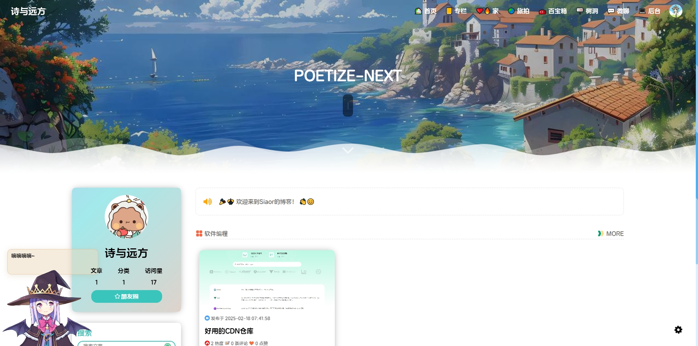

主要展示个人博客、文章

---

💒家 ↓

狗粮满天飞

---

💒文章 ↓

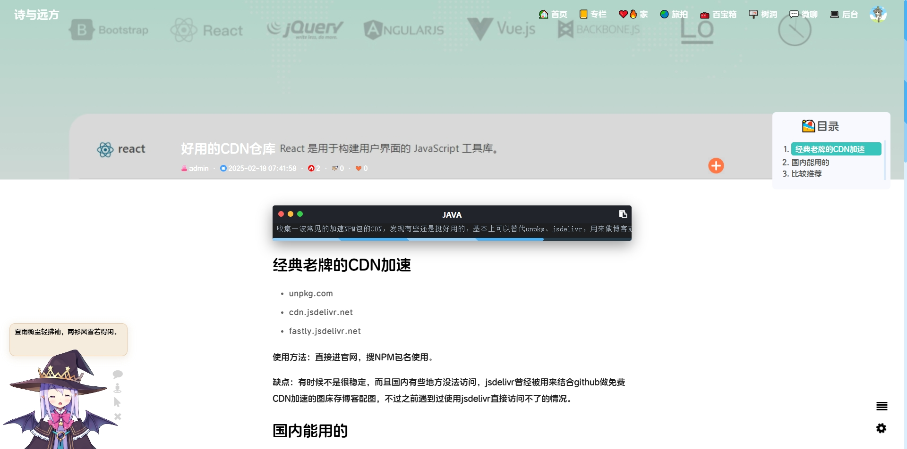

博客文章的详情页面

---

💒百宝箱 ↓

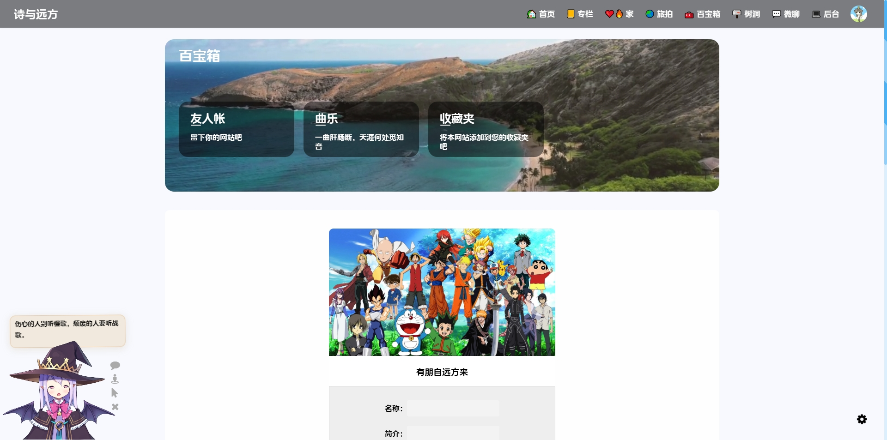

友链、个人音乐库、收藏的网站资源

---

🌳树洞 ↓

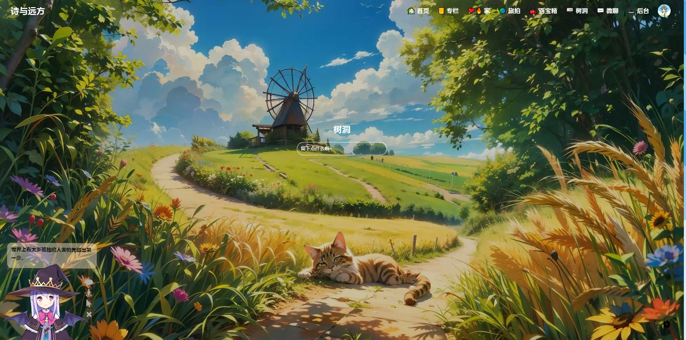

不用登录，任何人都可以留言

---

💒微聊 ↓

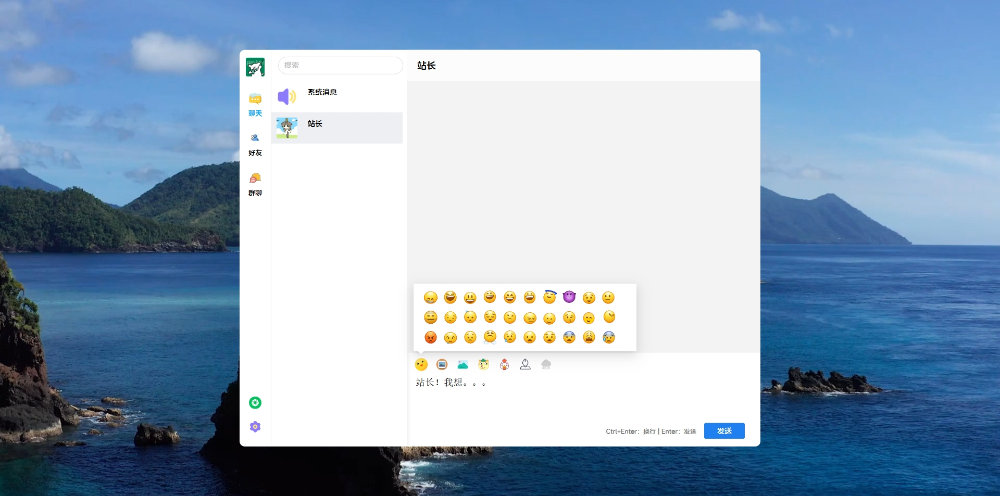

需要登录，可以聊天吹牛

---

💒旅拍 ↓

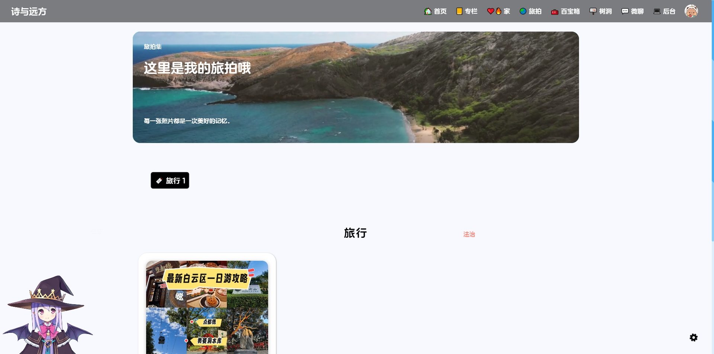

展示旅行照片

---

💒后台 ↓

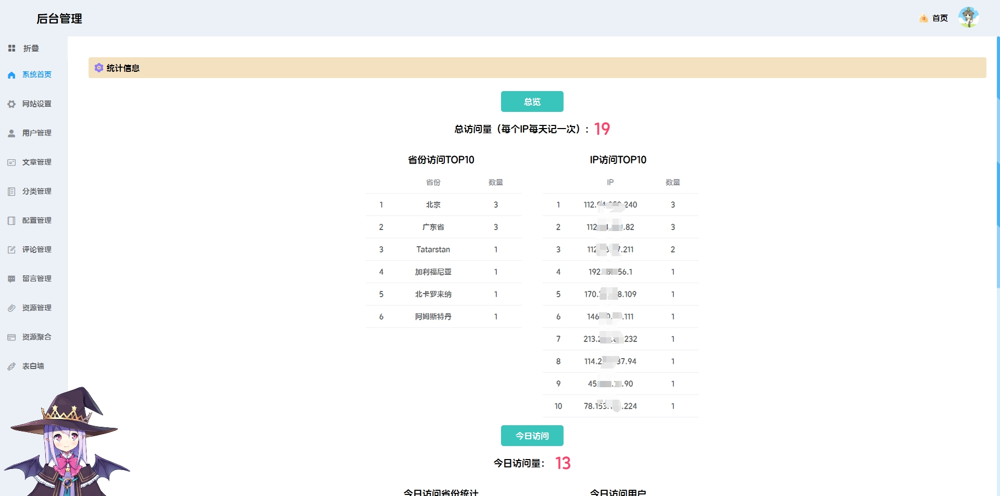

管理文章、用户、系统配置等

---

💒移动端-首页 ↓

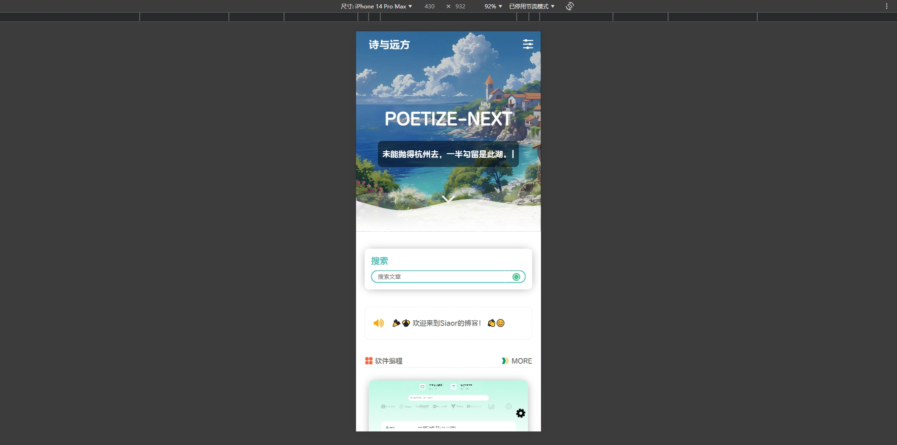

💒移动端-文章 ↓

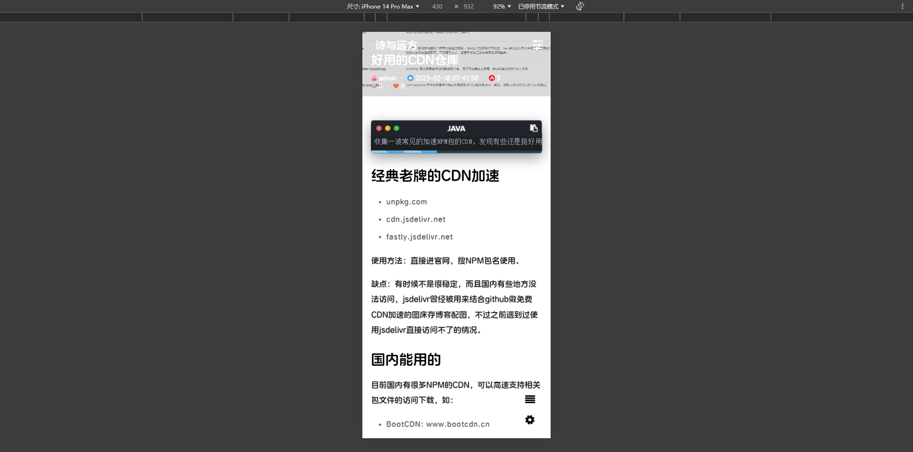

💒移动端-菜单 ↓

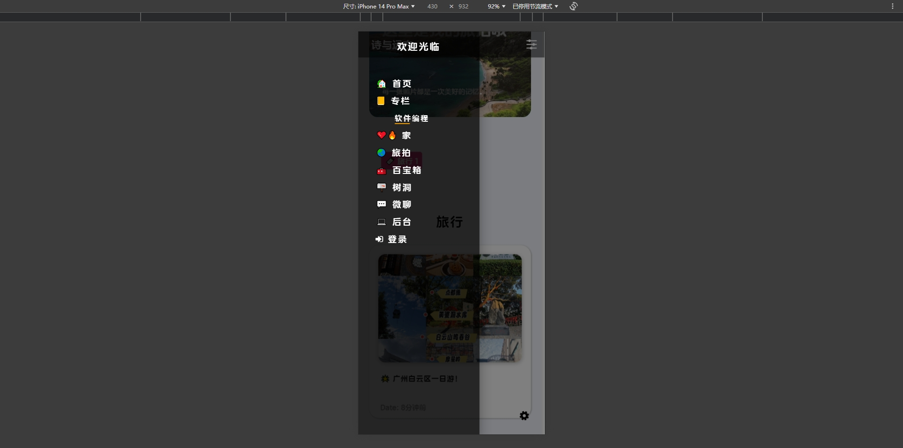

移动端自适应，功能一样

---

## 请作者喝咖啡

---

*你随手赞助的咖啡会让人兴奋得睡不着觉，一拍大腿！又出一个新功能！*

---

欢迎大家来博客反馈，在[树洞]可以匿名反馈，在[微聊]博主可以实时收到反馈消息，夜深人静的时候注意点，咳咳~

---