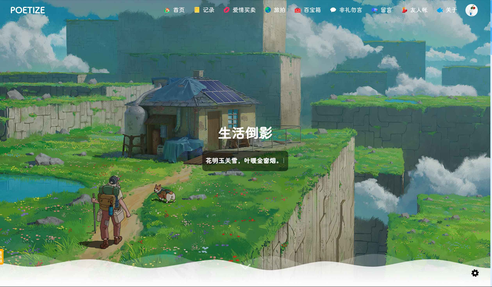

 
 
<h1 align="center">POETIZE-NEXT</h1>
<h2 align="center">📜诗与远方，博采方长🛤️</h2>
<h4 align="center">👩‍👩‍👧‍👦人 人 都 在 用 的 最 美 博 客📚</h4>
<h3 align="center">🌻请带上曾经的热情出发！🌞</h3>
<h3 align="center">✨遇见最美博客，下一站，出发！！🖌</h3>
<h3 align="center">️长江后浪推前浪，感谢每一位热爱分享的博主！</h3>
<h3 align="center">️点赞！⭐收藏！💬评论！🌟给个小星星！</h3>
<h3 align="center">☕请喝咖啡~</h3>

[预 览](https://blog.siaor.com) |
[官 网](http://www.siaor.com) |
[Q Q](https://qm.qq.com/cgi-bin/qm/qr?k=FE1-Pxzl-Ajo06_1asI4sE03C9YcUy20) |
[微 信](https://siaor.com/system/res/logo/wechat.jpg)

blog博客文章、相册、工具、友链、聊天室 IM

 

## 介绍
【POETIZE-NEXT】是基于[【LittleDonkey/POETIZE - 最美博客】](https://gitee.com/littledokey/poetize) 的后续改造项目，因为原项目不再维护，实属可惜。

于是，作为POETIZE的延续，**POETIZE-NEXT** 它来啦！下一站，让我们再次出发！

后续会对项目进行重构、优化、改造，更新技术栈、增加功能，如果各位笔友有好的想法欢迎留言。

项目已经拆分为三个仓库：

- 【后端】：https://github.com/siaor/poetize-next
- 【前端-博客】：https://github.com/siaor/poetize-next-web
- 【前端-聊天室】：https://github.com/siaor/poetize-next-im

仓库初始化代码为原项目master分支2024-07-05的提交c160a4a1ac992a482938f109533d401975db7dfc，如果后续有好的功能更新，也会合并到NEXT中，也欢迎大家贡献自己的代码。

GitHub为主仓库，Gitee、GitCode会定时自动同步拉取最新代码，大家尽量在博客中留言，不经常上社区看。

Siaor也将使用**POETIZE-NEXT**作为个人博客，欢迎来访，看效果、学习！→【[https://blog.siaor.com](https://blog.siaor.com)】

---
**郑重承诺：****你部署的POETIZE-NEXT，和我的一样，收费神马的，咱不做的！当然，谁都缺钱，有钱的捧个钱场，没钱的捧个人场，在POETIZE-NEXT我们秉承大家一起用！分享生活！交流技术！重燃写作热情！**

如果有帮到你，或者非常想赞助，匿名赞助在底部扫码，在[SIAOR博客](https://blog.siaor.com)赞助可以上赞助榜单（预订功能，后续加）。

钱不钱的，我对赚钱不感兴趣！我从来都喜欢钱！

---

**PS**：群什么的，现在懒得维护，以后再说。二次开发、部署教程会逐渐完善，稍等一下下。

## 技术栈
这是一个 SpringBoot + Vue2 + Vue3 的产物，支持移动端自适应，配有完备的前台和后台管理功能。

前端技术：Vue2（博客系统），Vue3（IM 聊天室系统），Element UI（Vue2），Element-Plus UI（Vue3），Naive UI（Vue3）

后端技术：Java，SpringBoot，MySQL，Mybatis-Plus，t-io，qiniu-java-sdk，spring-boot-starter-mail

网站前端分两个模块：
- 博客系统：具有文章，表白墙，图片墙，收藏夹，乐曲，视频播放，留言，友链，时间线，后台管理等功能。
- 聊天室系统：具有朋友圈（时间线），好友，群等功能。

本网站采用前后端分离进行实现，两个前端项目通过Nginx代理，后端使用Java。

部署网站需要安装Nginx、Java、MySQL，然后打包前后端项目并部署。

文件服务可以使用七牛云，也可以使用服务器。默认使用服务器。

Vue3（IM 聊天室系统）是非必须的。如果部署，则需要依赖博客，然后从博客的“微聊”进入，因为登录模块在博客。

---

**PS**：先延用之前的文档，后面要重构的。

## 安装部署

---

详见：
[《安装部署手册》](https://blog.siaor.com/article/6)

## 二次开发

---

详见：
[《开发手册》](https://blog.siaor.com/article/7)

---

**PS**：为了方便相关文档的迭代更新，统一放于博客中。

## 展示

---

来吧！展示！

以下为部署了POETIZE-NEXT的博主，点击前往他们的博客看看效果吧！

    <a href="https://blog.siaor.com" target="_blank"> 『 SIAOR 』</a>

---

展示部分以后端项目为准：https://github.com/siaor/poetize-next

## 请作者喝咖啡

---

*你随手赞助的咖啡会让人兴奋得睡不着觉，一拍大腿！又出一个新功能！*

---

欢迎大家来博客反馈，在[树洞]可以匿名反馈，在[微聊]博主可以实时收到反馈消息，夜深人静的时候注意点，咳咳~

---